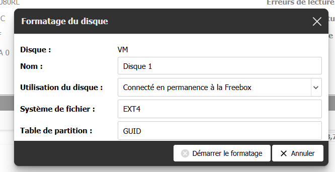
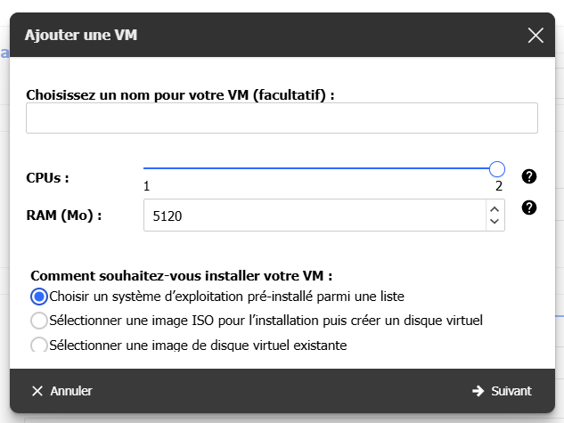
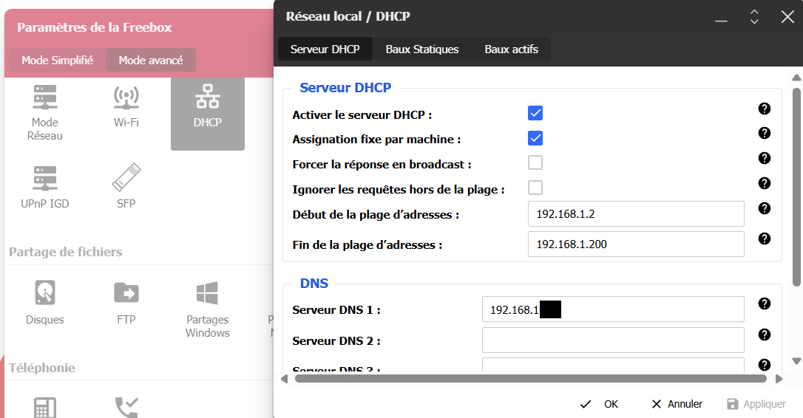

---
categories:
- Tutoriel
- Docker
- Freebox
tags:
- freebox
- aarch64
- arm
- docker
- docker-compose
- DNS

date: "2025-04-02T19:00:00+02:00"
title: Blocky sur la Freebox
---
Depuis quelque temps, je remarque que de plus en plus de publicités sont très intrusives et s'invitent sur tous mes appareils !

J'ai donc décidé de mettre en place un DNS menteur qui va filtrer les sites que je ne veux pas.  
Ça ne supprimera pas tout, mais c'est un bon début ! J'ai choisi [Blocky](https://0xerr0r.github.io/blocky/latest/) pour cela.

J'ai une Freebox Delta à la maison. Elle permet de lancer des VM sans avoir besoin d'un Raspberry Pi ou d'une autre machine allumée en permanence.

## 1. Installation d'un disque ##
Vous devrez en installer un. Voici les étapes pour ajouter un disque à votre Freebox Delta :

**Achetez un disque dur compatible** : Assurez-vous de choisir un disque dur 2,5" SATA compatible avec la Freebox Delta. Je vous conseille de prendre un SSD, cela ne coûte pas très cher.

(Vous pourrez en profiter pour [ajouter de la RAM](https://plessy.me/augmenter-a-8go-la-ram-de-la-freebox-delta/))

Pour l'installation, c'est par ici : [Installer un (ou plusieurs) disque(s) dur(s) - Assistance Free](https://assistance.free.fr/articles/635)

Vous devrez ensuite le formater :  
Cela se passe dans votre interface [mafreebox](http://mafreebox.freebox.fr/), allez dans "Paramètres de la Freebox", puis, dans l'onglet "Mode Avancé", "Disque".

Choisissez votre disque et configurez-le comme ceci :  


## 2. Préparation de la VM ##
Toujours sur l'interface de la Freebox, allez dans le menu "VMs", et ajoutez une VM :  
  
(vous pouvez lui donner un nom)

Ensuite, choisissez le système "Debian 12 (Bookworm)", changez l'utilisateur par défaut, vous pouvez aussi mettre votre clé publique SSH si vous en avez une... Pensez à mettre un mot de passe fort !

Lancez le téléchargement.

Une fois terminé, on va passer à 2 CPU pour notre VM  
(on a 2 CPU disponibles en tout, mais on ne va pas lancer plusieurs VM, on mutualisera sur notre VM les autres services).

On relance la VM.

Une fois démarrée, vous devriez avoir l'IPv4 et l'IPv6 qui apparaissent, notez les!

Connectez-vous via SSH.

Voici un petit script pour "accélérer la mise en place", au programme :  
- mise à jour de Debian  
- installation de Docker

{}

Reconnectez-vous (pour avoir les droits sur Docker).

## 3. Le(s) docker-compose ##

Créez un dossier "*blocky*" et un sous-dossier "*docker-compose*" :
```bash
mkdir -p ~/blocky/docker-compose
```

Nous allons découper notre composition docker en plusieurs services.

### {}

### {}

### {}

### {}


## 4. Configuration ##

On crée les différents dossiers:
```bash
mkdir -p ~/blocky/lists_updaters/watch ~/blocky/lists_updaters/sources ~/blocky/docker-compose/blocky
```


### {}


Modifiez la zone à votre convenance, pensez bien à noter vos IP:
```yaml
  zone: |
    $ORIGIN local.
    dns     3600  A     192.168.1.X
    dns     3600  AAAA  2a01:monIPv6:::::
    @       3600  CNAME dns
    mafreebox     A     192.168.1.254
    grafana       CNAME	dns
    blocky        CNAME	dns
```

### On va maintenant ajouter les listes:
### {}


### {}


### {}

### {}


## 5. On lance ##

Placez-vous dans le dossier *~/blocky* puis lancez la composition docker.
```bash
cd ~/blocky
docker compose up -d
```
Docker va télécharger les images et lancer les services.

Pour tester :
```bash
sudo apt install -y bind9-dnsutils
nslookup google.fr 192.168.1.X # <-- remplacez par l'ip de la VM

```

## 6. Configuration du DHCP de la Freebox ##

Allez dans les paramètres de la Freebox, DHCP :  
  
Remplissez le champ "**Serveur DNS 1**".

Allez dans l'onglet "**Baux statiques**", et cliquez sur "**Ajouter un bail statique**". Sélectionnez votre VM dans le champ "**MAC**", saisissez votre IPv4 et sauvegardez.

*Lors d'une prochaine connexion, Blocky sera utilisé comme serveur DNS.*

**Si vous avez besoin de revenir en arrière, il faut remettre l'IP de la Freebox (192.168.1.254) dans le champ *Serveur DNS 1*.**

