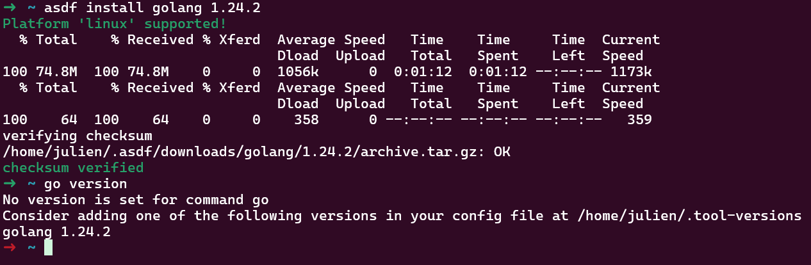
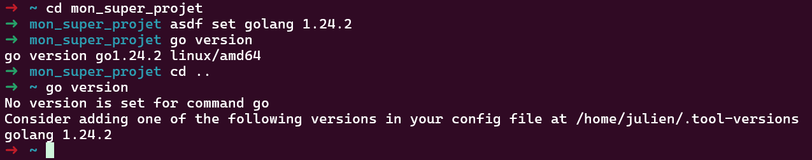
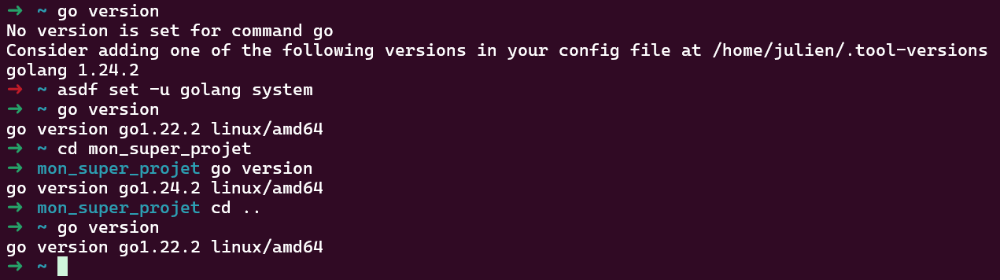
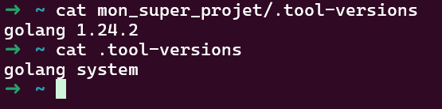

At work, our dev team works with various technologies like NodeJS/Typescript, Java, Go...

And from time to time, we need to revisit a project to make some changes.
And often, it's the same story:
> Oh yeah, but this project is legacy, it doesn't compile with the current versions anymore. I either have to rewrite everything or reinstall an old version that's no longer available on Debian...

Sometimes we also hear:
> Well, it works on my machine. What version of Node do you have? Because it only works with version 22 or 23, I can't remember...

And especially:
> Oh! Your CI is broken again 😉 You probably don't have the right version. Tsk tsk tsk...

That's when I found this little tool that will solve ~~all~~ my problems!

## [ASDF](https://asdf-vm.com/) !

It comes as a binary that you place in your `$PATH` (e.g., ~/bin).

Then, you need to add 3 lines to your `.bashrc` / `.zshrc` / `.your_favorite_shell_config_file`.
[More details here](https://asdf-vm.com/guide/getting-started.html)

For example, for Bash:
```bash
export ASDF_DATA_DIR="$HOME/.asdf"
export PATH="${ASDF_DATA_DIR:-$HOME/.asdf}/shims:$PATH"
. <(asdf completion bash)
```

After that, it allows you to install a multitude of tools in almost any version!
It achieves this through plugins selected by the team, but you can also use community plugins or create your own!

## Example with [Go](https://go.dev/) :

Imagine I need to test some software with version 1.24.2 because it includes a super cool feature...

Ubuntu only offers Go 1.22... I could install it manually, but doing that for every version is tedious and not very convenient.
(Yes, I know I could also use the `toolchain` option in the `go.mod`, but that's not the point here)

```bash
asdf plugin add golang
asdf install golang 1.24.2
```

Simple, right? Plus, I don't need to add the plugin again next time!


Well, it doesn't work... And on top of that, I broke my Go!

Don't worry, this is where the magic happens!
Go to your project and enter the magic formula ```asdf set golang 1.24.2``` 
OK, but what about other directories???

We'll tell asdf to use the system version for everything else ```asdf set -u golang system``` 
As you can see, as soon as you're in your project folder, you have version 1.24.2, but everywhere else, it's the system version!

You'll also notice that a `.tool-versions` file has been created.

You need to add it to the project so that everyone uses the same version! (As long as they also have asdf installed 😉)

**Note: Go tools are also in the asdf folder, so you'll need to reinstall them with each new version! (After running `asdf set`)**