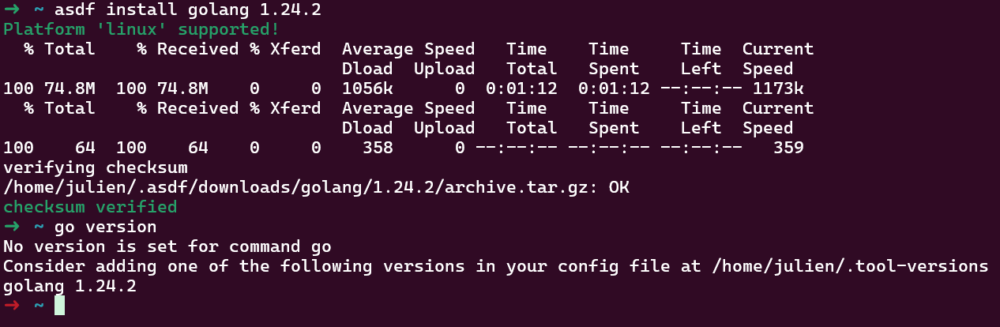
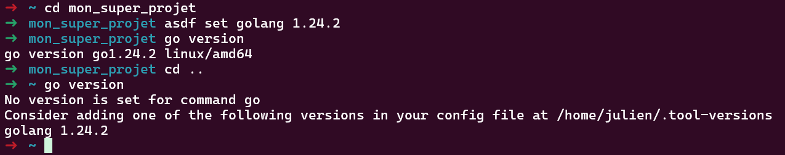
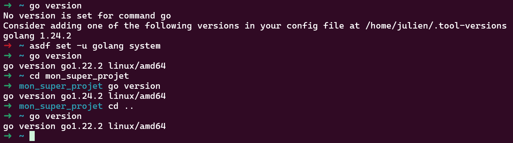
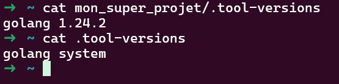

Au travail, notre équipe de dev' travaille avec différentes technos, du NodeJS/Typescript, Java, Go...

Et de temps en temps, nous devons revenir sur un projet pour apporter une modification.
Et régulièrement c'est la même histoire :
> Ah oui mais ce projet, c'est du legacy, ça ne compile plus avec les versions actuelles, je dois soit tout réécrire, soit réinstaller une vieille version qui n'est plus dispo sur Debian...

Parfois on a aussi :
> Bah chez moi ça compile, t'as quelle version de Node ? Parce que ça marche qu'avec la version 22 ou 23 je sais plus...

Et surtout :
> Ah ! Ta CI est encore plantée 😉 Tu dois pas avoir la bonne version. Rho rho rho...

C'est alors que j'ai trouvé ce petit outil qui va résoudre ~~tous~~ mes problèmes !

## [ASDF](https://asdf-vm.com/)

Il se présente sous la forme d'un binaire à poser dans votre `$PATH` (~/bin par exemple).

Ensuite il faut ajouter 3 lignes à votre `.bashrc` / `.zshrc` / `.fichier_de_conf_de_votre_shell_préféré`.
[Plus de détails ici](https://asdf-vm.com/guide/getting-started.html)

Par exemple pour Bash :

```bash
export ASDF_DATA_DIR="$HOME/.asdf"
export PATH="${ASDF_DATA_DIR:-$HOME/.asdf}/shims:$PATH"
. <(asdf completion bash)
```

Ensuite, il vous permet d'installer une foultitude d'outils dans presque toutes les versions !
Il y arrive grâce aux plugins que l'équipe a sélectionnés mais vous pouvez aussi prendre ceux de la communauté ou créer les vôtres !

## Exemple avec [Go](https://go.dev/)

Imaginons que j'ai besoin de tester un soft avec la version 1.24.2 parce qu'il y a une implémentation d'une fonctionnalité hyper cool...

Ubuntu ne propose que Go 1.22... Je pourrais faire l'installation à la main mais à chaque version c'est usant et pas hyper pratique.
(Alors oui je sais que je peux aussi utiliser l'option `toolchain` dans le `go.mod` mais c'est pas le sujet)

```bash
asdf plugin add golang
asdf install golang 1.24.2
```

Simple non ? En plus je n'ai plus besoin de rajouter le plugin pour les prochaines fois !


Bon bah, ça marche pas... Et en plus j'ai cassé mon Go !

Détrompe-toi, c'est maintenant que la magie va opérer !
Va dans ton projet et entre la formule magique ```asdf set golang 1.24.2``` 
OK mais dans les autres dossiers ???

On va dire à asdf d'utiliser la version du système pour le reste ```asdf set -u golang system``` 
Comme tu peux le voir, dès que tu es dans le dossier de ton projet tu as la version 1.24.2 mais partout ailleurs c'est la version du système !

Tu verras également qu'un fichier ```.tool-versions``` a été créé.

Il faut l'ajouter au projet, ainsi tout le monde utilisera la même version ! (S'ils ont aussi asdf installé 😉)

**Attention : les outils Go sont aussi dans le dossier d'asdf, il faut donc les réinstaller à chaque nouvelle version ! (Après avoir fait le `asdf set`)**
